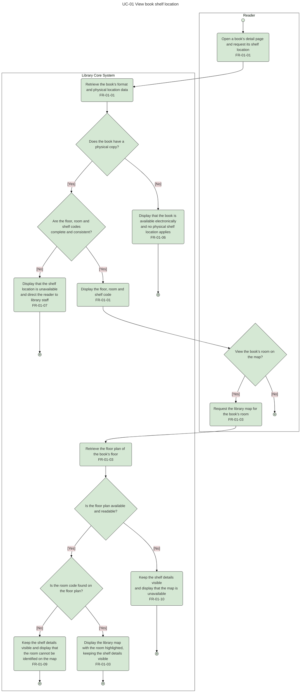

```mermaid
---
title: UC-01 View book shelf location
config:
  theme: base
  themeVariables:
    primaryColor: "#d5e8d4"
    primaryBorderColor: "#333333"
    lineColor: "#000000"
    clusterBkg: "#ffffff"
    clusterBorder: "#333333"
---
flowchart TB
  subgraph RDR["Reader"]
    direction TB
    start@{ shape: sm-circ }
    r1("Open a book's detail page and request its shelf location<br/>FR-01-01")
    d3{"View the book's room on the map?"}
    r2("Request the library map for the book's room<br/>FR-01-03")
    stop3@{ shape: fr-circ }
  end
  subgraph SYS["Library Core System"]
    direction TB
    s1("Retrieve the book's format and physical location data<br/>FR-01-01")
    d1{"Does the book have a physical copy?"}
    s2("Display that the book is available electronically<br/>and no physical shelf location applies<br/>FR-01-06")
    d2{"Are the floor, room and shelf codes<br/>complete and consistent?"}
    s3("Display that the shelf location is unavailable<br/>and direct the reader to library staff<br/>FR-01-07")
    s4("Display the floor, room and shelf code<br/>FR-01-01")
    s5("Retrieve the floor plan of the book's floor<br/>FR-01-03")
    d4{"Is the floor plan available and readable?"}
    s6("Keep the shelf details visible<br/>and display that the map is unavailable<br/>FR-01-10")
    d5{"Is the room code found on the floor plan?"}
    s7("Keep the shelf details visible and display that<br/>the room cannot be identified on the map<br/>FR-01-09")
    s8("Display the library map with the room highlighted,<br/>keeping the shelf details visible<br/>FR-01-03")
    stop1@{ shape: fr-circ }
    stop2@{ shape: fr-circ }
    stop4@{ shape: fr-circ }
    stop5@{ shape: fr-circ }
    stop6@{ shape: fr-circ }
  end

  start --> r1 --> s1 --> d1
  d1 -->|"[No]"| s2 --> stop1
  d1 -->|"[Yes]"| d2
  d2 -->|"[No]"| s3 --> stop2
  d2 -->|"[Yes]"| s4 --> d3
  d3 -->|"[No]"| stop3
  d3 -->|"[Yes]"| r2 --> s5 --> d4
  d4 -->|"[No]"| s6 --> stop4
  d4 -->|"[Yes]"| d5
  d5 -->|"[No]"| s7 --> stop5
  d5 -->|"[Yes]"| s8 --> stop6
```
