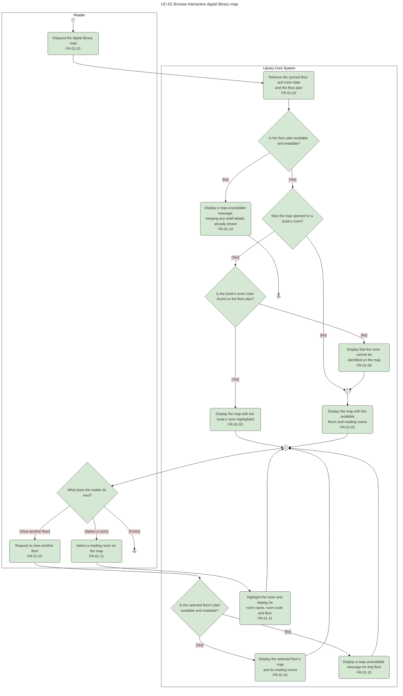

```mermaid
---
title: UC-02 Browse interactive digital library map
config:
  theme: base
  themeVariables:
    primaryColor: "#d5e8d4"
    primaryBorderColor: "#333333"
    lineColor: "#000000"
    clusterBkg: "#ffffff"
    clusterBorder: "#333333"
---
flowchart TB
  subgraph RDR["Reader"]
    direction TB
    start@{ shape: sm-circ }
    r1("Request the digital library map<br/>FR-01-02")
    d4{"What does the reader do next?"}
    r2("Request to view another floor<br/>FR-01-02")
    r3("Select a reading room on the map<br/>FR-01-11")
    stop2@{ shape: fr-circ }
  end
  subgraph SYS["Library Core System"]
    direction TB
    s1("Retrieve the synced floor and room data<br/>and the floor plan<br/>FR-01-02")
    d1{"Is the floor plan available and readable?"}
    s2("Display a map-unavailable message,<br/>keeping any shelf details already shown<br/>FR-01-10")
    d2{"Was the map opened for a book's room?"}
    d3{"Is the book's room code found on the floor plan?"}
    s3("Display the map with the book's room highlighted<br/>FR-01-03")
    s4("Display that the room cannot be<br/>identified on the map<br/>FR-01-09")
    m1{" "}
    s5("Display the map with the available<br/>floors and reading rooms<br/>FR-01-02")
    m2{" "}
    d5{"Is the selected floor's plan<br/>available and readable?"}
    s6("Display the selected floor's map<br/>and its reading rooms<br/>FR-01-02")
    s7("Display a map-unavailable message for that floor<br/>FR-01-10")
    s8("Highlight the room and display its<br/>room name, room code and floor<br/>FR-01-11")
    stop1@{ shape: fr-circ }
  end

  start --> r1 --> s1 --> d1
  d1 -->|"[No]"| s2 --> stop1
  d1 -->|"[Yes]"| d2
  d2 -->|"[No]"| m1
  d2 -->|"[Yes]"| d3
  d3 -->|"[Yes]"| s3 --> m2
  d3 -->|"[No]"| s4 --> m1
  m1 --> s5 --> m2
  m2 --> d4
  d4 -->|"[View another floor]"| r2 --> d5
  d5 -->|"[Yes]"| s6 --> m2
  d5 -->|"[No]"| s7 --> m2
  d4 -->|"[Select a room]"| r3 --> s8 --> m2
  d4 -->|"[Finish]"| stop2
```
