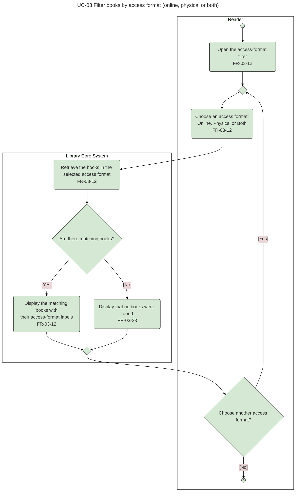

```mermaid
---
title: UC-03 Filter books by access format (online, physical or both)
config:
  theme: base
  themeVariables:
    primaryColor: "#d5e8d4"
    primaryBorderColor: "#333333"
    lineColor: "#000000"
    clusterBkg: "#ffffff"
    clusterBorder: "#333333"
---
flowchart TB
  subgraph RDR["Reader"]
    direction TB
    start@{ shape: sm-circ }
    r1("Open the access-format filter<br/>FR-03-12")
    m1{" "}
    r2("Choose an access format:<br/>Online, Physical or Both<br/>FR-03-12")
    d2{"Choose another access format?"}
    stop1@{ shape: fr-circ }
  end
  subgraph SYS["Library Core System"]
    direction TB
    s1("Retrieve the books in the selected access format<br/>FR-03-12")
    d1{"Are there matching books?"}
    s2("Display the matching books with<br/>their access-format labels<br/>FR-03-12")
    s3("Display that no books were found<br/>FR-03-23")
    m2{" "}
  end

  start --> r1 --> m1 --> r2 --> s1 --> d1
  d1 -->|"[Yes]"| s2 --> m2
  d1 -->|"[No]"| s3 --> m2
  m2 --> d2
  d2 -->|"[Yes]"| m1
  d2 -->|"[No]"| stop1
```
