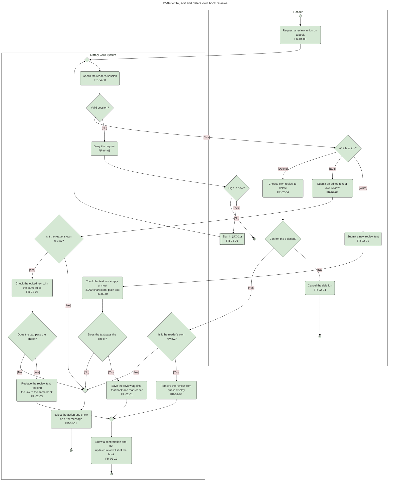

```mermaid
---
title: UC-04 Write, edit and delete own book reviews
config:
  theme: base
  themeVariables:
    primaryColor: "#d5e8d4"
    primaryBorderColor: "#333333"
    lineColor: "#000000"
    clusterBkg: "#ffffff"
    clusterBorder: "#333333"
---
flowchart TB
  subgraph RDR["Reader"]
    direction TB
    start@{ shape: sm-circ }
    r1("Request a review action on a book<br/>FR-04-08")
    d1{"Sign in now?"}
    c1[["Sign in (UC-11)<br/>FR-04-01"]]
    d2{"Which action?"}
    r2("Submit a new review text<br/>FR-02-01")
    r3("Submit an edited text of own review<br/>FR-02-03")
    r4("Choose own review to delete<br/>FR-02-04")
    d6{"Confirm the deletion?"}
    r5("Cancel the deletion<br/>FR-02-04")
    stop1@{ shape: fr-circ }
    stop2@{ shape: fr-circ }
  end
  subgraph SYS["Library Core System"]
    direction TB
    m0{" "}
    s0("Check the reader's session<br/>FR-04-08")
    d0{"Valid session?"}
    s1("Deny the request<br/>FR-04-08")
    s2("Check the text: not empty, at most<br/>2,000 characters, plain text<br/>FR-02-01")
    d3{"Does the text pass the check?"}
    s3("Save the review against that book and that reader<br/>FR-02-01")
    d4{"Is it the reader's own review?"}
    s4("Check the edited text with the same rules<br/>FR-02-03")
    d5{"Does the text pass the check?"}
    s5("Replace the review text, keeping<br/>the link to the same book<br/>FR-02-03")
    d7{"Is it the reader's own review?"}
    s6("Remove the review from public display<br/>FR-02-04")
    me{" "}
    s7("Reject the action and show an error message<br/>FR-02-11")
    m2{" "}
    s8("Show a confirmation and the<br/>updated review list of the book<br/>FR-02-12")
    stop3@{ shape: fr-circ }
    stop4@{ shape: fr-circ }
  end

  start --> r1 --> m0 --> s0 --> d0
  d0 -->|"[No]"| s1 --> d1
  d1 -->|"[Yes]"| c1 --> m0
  d1 -->|"[No]"| stop1
  d0 -->|"[Yes]"| d2
  d2 -->|"[Write]"| r2 --> s2 --> d3
  d3 -->|"[Yes]"| s3 --> m2
  d3 -->|"[No]"| me
  d2 -->|"[Edit]"| r3 --> d4
  d4 -->|"[No]"| me
  d4 -->|"[Yes]"| s4 --> d5
  d5 -->|"[Yes]"| s5 --> m2
  d5 -->|"[No]"| me
  d2 -->|"[Delete]"| r4 --> d6
  d6 -->|"[No]"| r5 --> stop2
  d6 -->|"[Yes]"| d7
  d7 -->|"[Yes]"| s6 --> m2
  d7 -->|"[No]"| me
  me --> s7 --> stop3
  m2 --> s8 --> stop4
```
