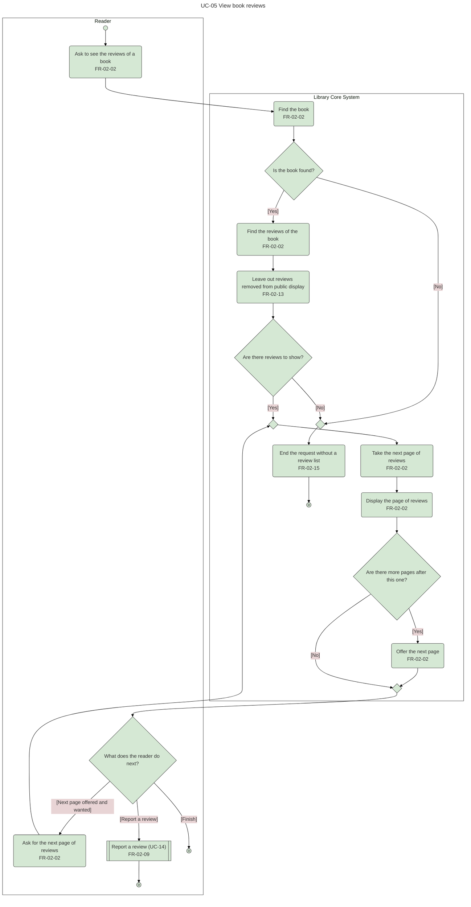

```mermaid
---
title: UC-05 View book reviews
config:
  theme: base
  themeVariables:
    primaryColor: "#d5e8d4"
    primaryBorderColor: "#333333"
    lineColor: "#000000"
    clusterBkg: "#ffffff"
    clusterBorder: "#333333"
---
flowchart TB
  subgraph RDR["Reader"]
    direction TB
    start@{ shape: sm-circ }
    r1("Ask to see the reviews of a book<br/>FR-02-02")
    d4{"What does the reader do next?"}
    r2("Ask for the next page of reviews<br/>FR-02-02")
    c1[["Report a review (UC-14)<br/>FR-02-09"]]
    stop2@{ shape: fr-circ }
    stop3@{ shape: fr-circ }
  end
  subgraph SYS["Library Core System"]
    direction TB
    s1("Find the book<br/>FR-02-02")
    d1{"Is the book found?"}
    s2("Find the reviews of the book<br/>FR-02-02")
    s3("Leave out reviews removed from public display<br/>FR-02-13")
    d2{"Are there reviews to show?"}
    mn{" "}
    s4("End the request without a review list<br/>FR-02-15")
    m1{" "}
    s5("Take the next page of reviews<br/>FR-02-02")
    s6("Display the page of reviews<br/>FR-02-02")
    d3{"Are there more pages after this one?"}
    s7("Offer the next page<br/>FR-02-02")
    m3{" "}
    stop1@{ shape: fr-circ }
  end

  start --> r1 --> s1 --> d1
  d1 -->|"[No]"| mn
  d1 -->|"[Yes]"| s2 --> s3 --> d2
  d2 -->|"[No]"| mn
  mn --> s4 --> stop1
  d2 -->|"[Yes]"| m1 --> s5 --> s6 --> d3
  d3 -->|"[Yes]"| s7 --> m3
  d3 -->|"[No]"| m3
  m3 --> d4
  d4 -->|"[Next page offered and wanted]"| r2 --> m1
  d4 -->|"[Report a review]"| c1 --> stop2
  d4 -->|"[Finish]"| stop3
```
