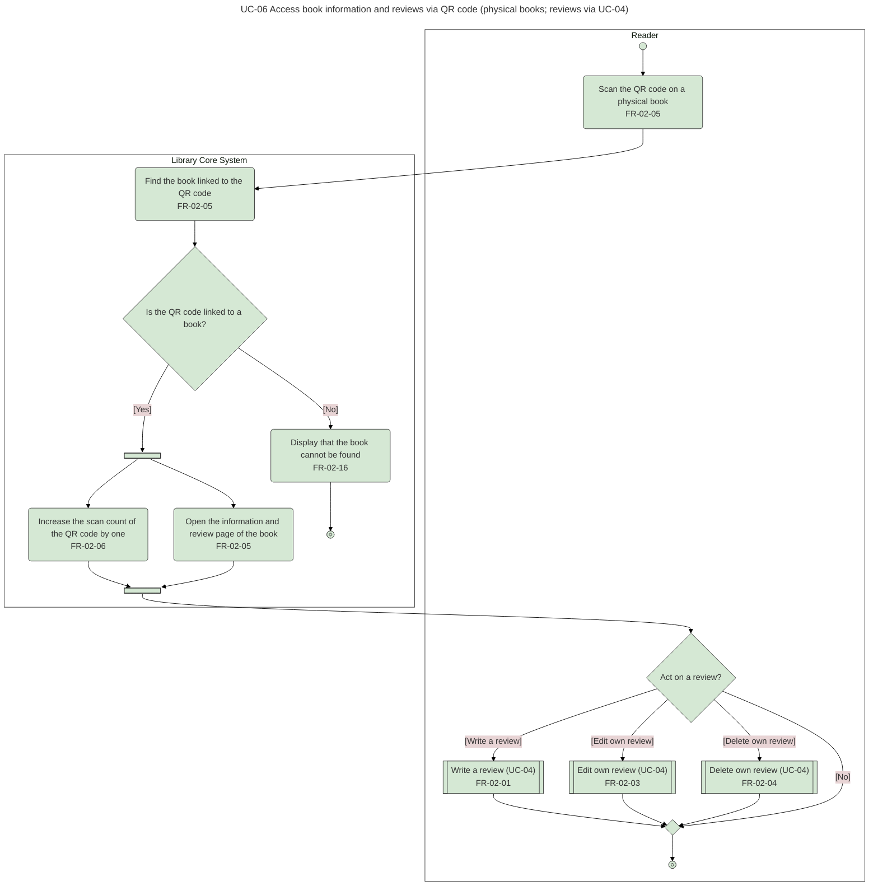

```mermaid
---
title: UC-06 Access book information and reviews via QR code (physical books; reviews via UC-04)
config:
  theme: base
  themeVariables:
    primaryColor: "#d5e8d4"
    primaryBorderColor: "#333333"
    lineColor: "#000000"
    clusterBkg: "#ffffff"
    clusterBorder: "#333333"
---
flowchart TB
  subgraph RDR["Reader"]
    direction TB
    start@{ shape: sm-circ }
    r1("Scan the QR code on a physical book<br/>FR-02-05")
    d2{"Act on a review?"}
    c1[["Write a review (UC-04)<br/>FR-02-01"]]
    c2[["Edit own review (UC-04)<br/>FR-02-03"]]
    c3[["Delete own review (UC-04)<br/>FR-02-04"]]
    m1{" "}
    stop2@{ shape: fr-circ }
  end
  subgraph SYS["Library Core System"]
    direction TB
    s1("Find the book linked to the QR code<br/>FR-02-05")
    d1{"Is the QR code linked to a book?"}
    s2("Display that the book cannot be found<br/>FR-02-16")
    f1@{ shape: fork }
    s3("Increase the scan count of the QR code by one<br/>FR-02-06")
    s4("Open the information and review page of the book<br/>FR-02-05")
    j1@{ shape: fork }
    stop1@{ shape: fr-circ }
  end

  start --> r1 --> s1 --> d1
  d1 -->|"[No]"| s2 --> stop1
  d1 -->|"[Yes]"| f1
  f1 --> s3 --> j1
  f1 --> s4 --> j1
  j1 --> d2
  d2 -->|"[Write a review]"| c1 --> m1
  d2 -->|"[Edit own review]"| c2 --> m1
  d2 -->|"[Delete own review]"| c3 --> m1
  d2 -->|"[No]"| m1
  m1 --> stop2
```
