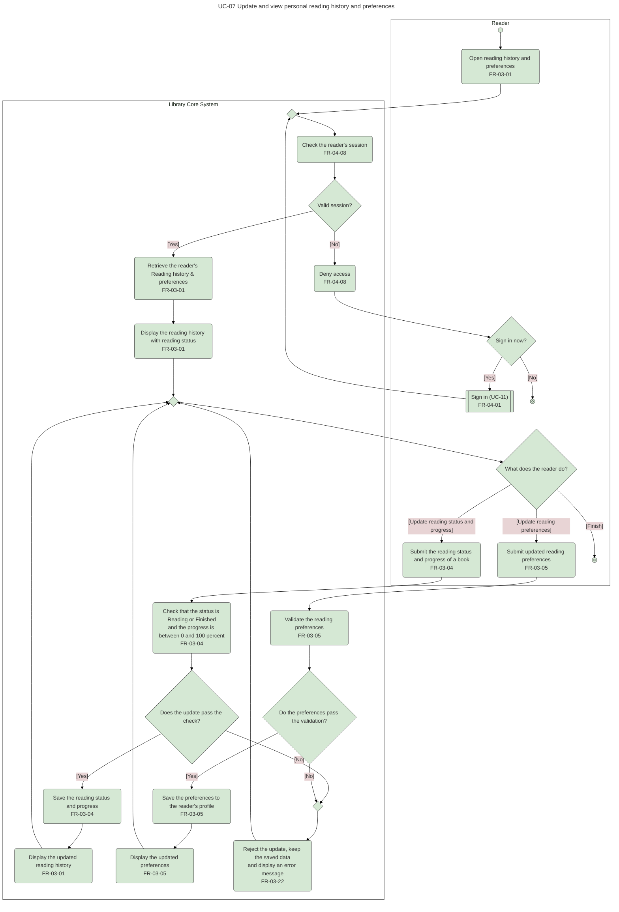

```mermaid
---
title: UC-07 Update and view personal reading history and preferences
config:
  theme: base
  themeVariables:
    primaryColor: "#d5e8d4"
    primaryBorderColor: "#333333"
    lineColor: "#000000"
    clusterBkg: "#ffffff"
    clusterBorder: "#333333"
---
flowchart TB
  subgraph RDR["Reader"]
    direction TB
    start@{ shape: sm-circ }
    r1("Open reading history and preferences<br/>FR-03-01")
    d1{"Sign in now?"}
    c1[["Sign in (UC-11)<br/>FR-04-01"]]
    d2{"What does the reader do?"}
    r2("Submit the reading status and progress of a book<br/>FR-03-04")
    r3("Submit updated reading preferences<br/>FR-03-05")
    stop1@{ shape: fr-circ }
    stop2@{ shape: fr-circ }
  end
  subgraph SYS["Library Core System"]
    direction TB
    m0{" "}
    s0("Check the reader's session<br/>FR-04-08")
    d0{"Valid session?"}
    s1("Deny access<br/>FR-04-08")
    s2("Retrieve the reader's Reading history & preferences<br/>FR-03-01")
    s3("Display the reading history with reading status<br/>FR-03-01")
    m1{" "}
    s4("Check that the status is Reading or Finished<br/>and the progress is between 0 and 100 percent<br/>FR-03-04")
    d3{"Does the update pass the check?"}
    s5("Save the reading status and progress<br/>FR-03-04")
    s6("Display the updated reading history<br/>FR-03-01")
    s7("Validate the reading preferences<br/>FR-03-05")
    d4{"Do the preferences pass the validation?"}
    s8("Save the preferences to the reader's profile<br/>FR-03-05")
    s9("Display the updated preferences<br/>FR-03-05")
    me{" "}
    s10("Reject the update, keep the saved data<br/>and display an error message<br/>FR-03-22")
  end

  start --> r1 --> m0 --> s0 --> d0
  d0 -->|"[No]"| s1 --> d1
  d1 -->|"[Yes]"| c1 --> m0
  d1 -->|"[No]"| stop1
  d0 -->|"[Yes]"| s2 --> s3 --> m1
  m1 --> d2
  d2 -->|"[Update reading status and progress]"| r2 --> s4 --> d3
  d3 -->|"[Yes]"| s5 --> s6 --> m1
  d3 -->|"[No]"| me
  d2 -->|"[Update reading preferences]"| r3 --> s7 --> d4
  d4 -->|"[Yes]"| s8 --> s9 --> m1
  d4 -->|"[No]"| me
  me --> s10 --> m1
  d2 -->|"[Finish]"| stop2
```
