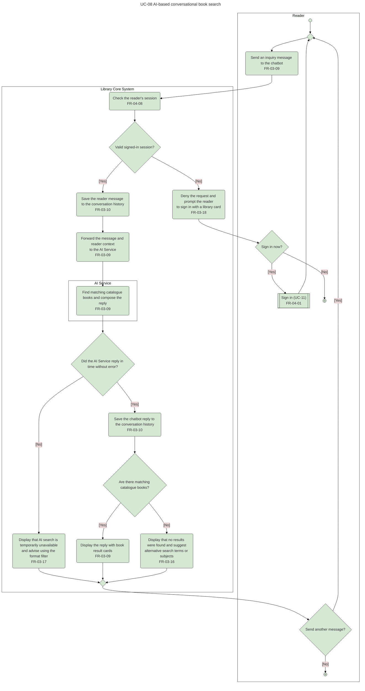

```mermaid
---
title: UC-08 AI-based conversational book search
config:
  theme: base
  themeVariables:
    primaryColor: "#d5e8d4"
    primaryBorderColor: "#333333"
    lineColor: "#000000"
    clusterBkg: "#ffffff"
    clusterBorder: "#333333"
---
flowchart TB
  subgraph RDR["Reader"]
    direction TB
    start@{ shape: sm-circ }
    m0{" "}
    r1("Send an inquiry message to the chatbot<br/>FR-03-09")
    d1{"Sign in now?"}
    c1[["Sign in (UC-11)<br/>FR-04-01"]]
    d4{"Send another message?"}
    stop1@{ shape: fr-circ }
    stop2@{ shape: fr-circ }
  end
  subgraph SYS["Library Core System"]
    direction TB
    s0("Check the reader's session<br/>FR-04-08")
    d0{"Valid signed-in session?"}
    s1("Deny the request and prompt the reader<br/>to sign in with a library card<br/>FR-03-18")
    s2("Save the reader message to the conversation history<br/>FR-03-10")
    s3("Forward the message and reader context<br/>to the AI Service<br/>FR-03-09")
    d2{"Did the AI Service reply in time without error?"}
    s4("Display that AI search is temporarily unavailable<br/>and advise using the format filter<br/>FR-03-17")
    s5("Save the chatbot reply to the conversation history<br/>FR-03-10")
    d3{"Are there matching catalogue books?"}
    s6("Display the reply with book result cards<br/>FR-03-09")
    s7("Display that no results were found and suggest<br/>alternative search terms or subjects<br/>FR-03-16")
    m2{" "}
    subgraph AIS["AI Service"]
      direction TB
      a1("Find matching catalogue books and compose the reply<br/>FR-03-09")
    end
  end

  start --> m0 --> r1 --> s0 --> d0
  d0 -->|"[No]"| s1 --> d1
  d1 -->|"[Yes]"| c1 --> m0
  d1 -->|"[No]"| stop1
  d0 -->|"[Yes]"| s2 --> s3 --> a1 --> d2
  d2 -->|"[No]"| s4 --> m2
  d2 -->|"[Yes]"| s5 --> d3
  d3 -->|"[Yes]"| s6 --> m2
  d3 -->|"[No]"| s7 --> m2
  m2 --> d4
  d4 -->|"[Yes]"| m0
  d4 -->|"[No]"| stop2
```
