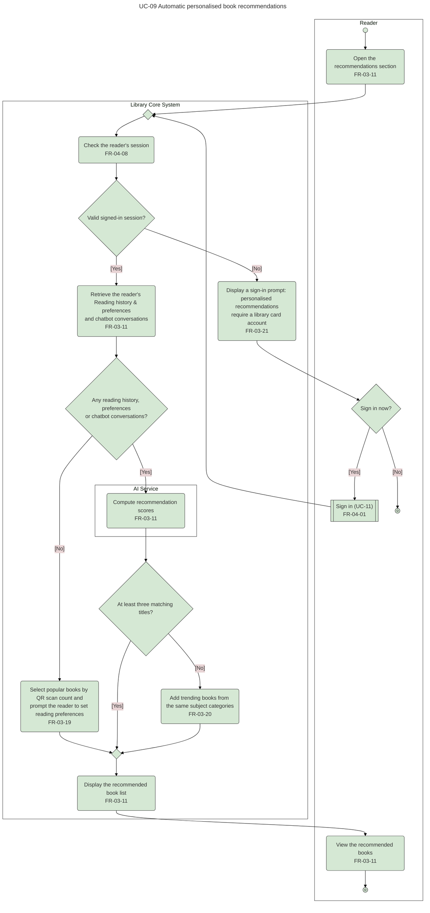

```mermaid
---
title: UC-09 Automatic personalised book recommendations
config:
  theme: base
  themeVariables:
    primaryColor: "#d5e8d4"
    primaryBorderColor: "#333333"
    lineColor: "#000000"
    clusterBkg: "#ffffff"
    clusterBorder: "#333333"
---
flowchart TB
  subgraph RDR["Reader"]
    direction TB
    start@{ shape: sm-circ }
    r1("Open the recommendations section<br/>FR-03-11")
    d1{"Sign in now?"}
    c1[["Sign in (UC-11)<br/>FR-04-01"]]
    r2("View the recommended books<br/>FR-03-11")
    stop1@{ shape: fr-circ }
    stop2@{ shape: fr-circ }
  end
  subgraph SYS["Library Core System"]
    direction TB
    m0{" "}
    s0("Check the reader's session<br/>FR-04-08")
    d0{"Valid signed-in session?"}
    s1("Display a sign-in prompt: personalised recommendations<br/>require a library card account<br/>FR-03-21")
    s2("Retrieve the reader's Reading history & preferences<br/>and chatbot conversations<br/>FR-03-11")
    d2{"Any reading history, preferences<br/>or chatbot conversations?"}
    s3("Select popular books by QR scan count and<br/>prompt the reader to set reading preferences<br/>FR-03-19")
    d3{"At least three matching titles?"}
    s4("Add trending books from the same subject categories<br/>FR-03-20")
    m1{" "}
    s5("Display the recommended book list<br/>FR-03-11")
    subgraph AIS["AI Service"]
      direction TB
      a1("Compute recommendation scores<br/>FR-03-11")
    end
  end

  start --> r1 --> m0 --> s0 --> d0
  d0 -->|"[No]"| s1 --> d1
  d1 -->|"[Yes]"| c1 --> m0
  d1 -->|"[No]"| stop1
  d0 -->|"[Yes]"| s2 --> d2
  d2 -->|"[No]"| s3 --> m1
  d2 -->|"[Yes]"| a1 --> d3
  d3 -->|"[Yes]"| m1
  d3 -->|"[No]"| s4 --> m1
  m1 --> s5 --> r2 --> stop2
```
