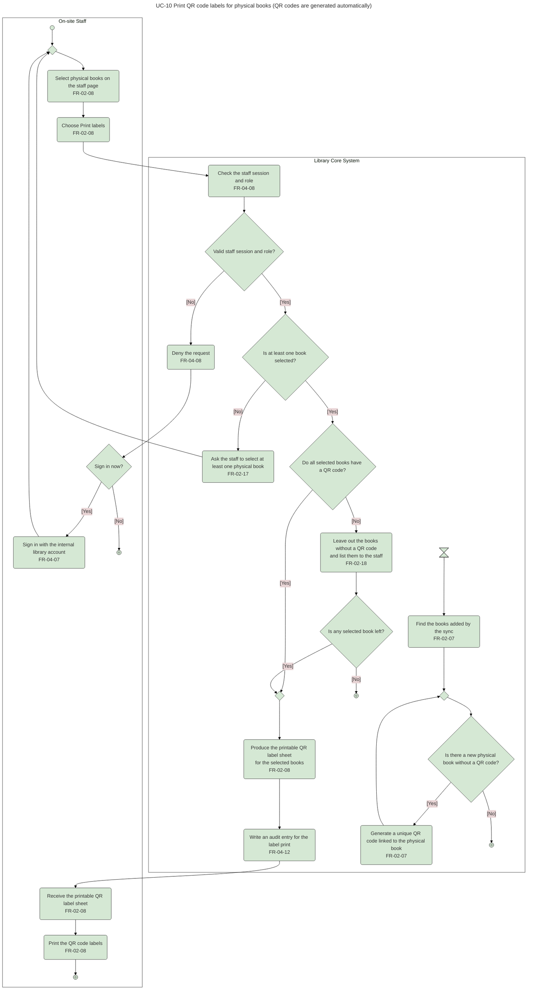

```mermaid
---
title: UC-10 Print QR code labels for physical books (QR codes are generated automatically)
config:
  theme: base
  themeVariables:
    primaryColor: "#d5e8d4"
    primaryBorderColor: "#333333"
    lineColor: "#000000"
    clusterBkg: "#ffffff"
    clusterBorder: "#333333"
---
flowchart TB
  subgraph STF["On-site Staff"]
    direction TB
    start@{ shape: sm-circ }
    m0{" "}
    a1("Select physical books on the staff page<br/>FR-02-08")
    a2("Choose Print labels<br/>FR-02-08")
    d1{"Sign in now?"}
    a3("Sign in with the internal library account<br/>FR-04-07")
    a4("Receive the printable QR label sheet<br/>FR-02-08")
    a5("Print the QR code labels<br/>FR-02-08")
    stop1@{ shape: fr-circ }
    stop3@{ shape: fr-circ }
  end
  subgraph SYS["Library Core System"]
    direction TB
    s0("Check the staff session and role<br/>FR-04-08")
    d0{"Valid staff session and role?"}
    s1("Deny the request<br/>FR-04-08")
    d2{"Is at least one book selected?"}
    s2("Ask the staff to select at least one physical book<br/>FR-02-17")
    d3{"Do all selected books have a QR code?"}
    s3("Leave out the books without a QR code<br/>and list them to the staff<br/>FR-02-18")
    d4{"Is any selected book left?"}
    m1{" "}
    s4("Produce the printable QR label sheet<br/>for the selected books<br/>FR-02-08")
    s5("Write an audit entry for the label print<br/>FR-04-12")
    stop2@{ shape: fr-circ }
    t1@{ shape: hourglass, label: "Daily catalogue sync finished" }
    s6("Find the books added by the sync<br/>FR-02-07")
    mg{" "}
    d5{"Is there a new physical book without a QR code?"}
    s7("Generate a unique QR code linked to the physical book<br/>FR-02-07")
    stop4@{ shape: fr-circ }
  end

  start --> m0 --> a1 --> a2 --> s0 --> d0
  d0 -->|"[No]"| s1 --> d1
  d1 -->|"[Yes]"| a3 --> m0
  d1 -->|"[No]"| stop1
  d0 -->|"[Yes]"| d2
  d2 -->|"[No]"| s2 --> m0
  d2 -->|"[Yes]"| d3
  d3 -->|"[Yes]"| m1
  d3 -->|"[No]"| s3 --> d4
  d4 -->|"[Yes]"| m1
  d4 -->|"[No]"| stop2
  m1 --> s4 --> s5 --> a4 --> a5 --> stop3

  t1 --> s6 --> mg --> d5
  d5 -->|"[Yes]"| s7 --> mg
  d5 -->|"[No]"| stop4
```
