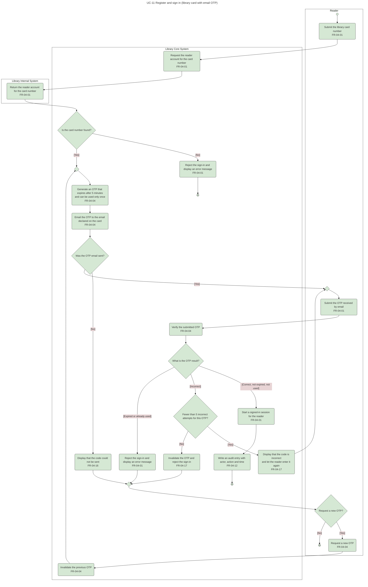

```mermaid
---
title: UC-11 Register and sign in (library card with email OTP)
config:
  theme: base
  themeVariables:
    primaryColor: "#d5e8d4"
    primaryBorderColor: "#333333"
    lineColor: "#000000"
    clusterBkg: "#ffffff"
    clusterBorder: "#333333"
---
flowchart TB
  subgraph RDR["Reader"]
    direction TB
    start@{ shape: sm-circ }
    r1("Submit the library card number<br/>FR-04-01")
    m2{" "}
    r2("Submit the OTP received by email<br/>FR-04-01")
    d5{"Request a new OTP?"}
    r3("Request a new OTP<br/>FR-04-04")
    stop3@{ shape: fr-circ }
  end
  subgraph SYS["Library Core System"]
    direction TB
    s1("Request the reader account for the card number<br/>FR-04-01")
    d1{"Is the card number found?"}
    s2("Reject the sign-in and display an error message<br/>FR-04-01")
    m1{" "}
    s3("Generate an OTP that expires after 5 minutes<br/>and can be used only once<br/>FR-04-04")
    s4("Email the OTP to the email declared on the card<br/>FR-04-04")
    d2{"Was the OTP email sent?"}
    s5("Display that the code could not be sent<br/>FR-04-16")
    s6("Verify the submitted OTP<br/>FR-04-04")
    d3{"What is the OTP result?"}
    s7("Start a signed-in session for the reader<br/>FR-04-01")
    s8("Write an audit entry with actor, action and time<br/>FR-04-12")
    d4{"Fewer than 5 incorrect attempts for this OTP?"}
    s9("Display that the code is incorrect<br/>and let the reader enter it again<br/>FR-04-17")
    s10("Invalidate the OTP and reject the sign-in<br/>FR-04-17")
    s11("Reject the sign-in and display an error message<br/>FR-04-01")
    m3{" "}
    s12("Invalidate the previous OTP<br/>FR-04-04")
    stop1@{ shape: fr-circ }
    stop2@{ shape: fr-circ }
  end
  subgraph INT["Library Internal System"]
    direction TB
    i1("Return the reader account for the card number<br/>FR-04-01")
  end

  start --> r1 --> s1 --> i1 --> d1
  d1 -->|"[No]"| s2 --> stop1
  d1 -->|"[Yes]"| m1 --> s3 --> s4 --> d2
  d2 -->|"[No]"| s5 --> m3
  d2 -->|"[Yes]"| m2 --> r2 --> s6 --> d3
  d3 -->|"[Correct, not expired, not used]"| s7 --> s8 --> stop2
  d3 -->|"[Incorrect]"| d4
  d4 -->|"[Yes]"| s9 --> m2
  d4 -->|"[No]"| s10 --> m3
  d3 -->|"[Expired or already used]"| s11 --> m3
  m3 --> d5
  d5 -->|"[Yes]"| r3 --> s12 --> m1
  d5 -->|"[No]"| stop3
```
