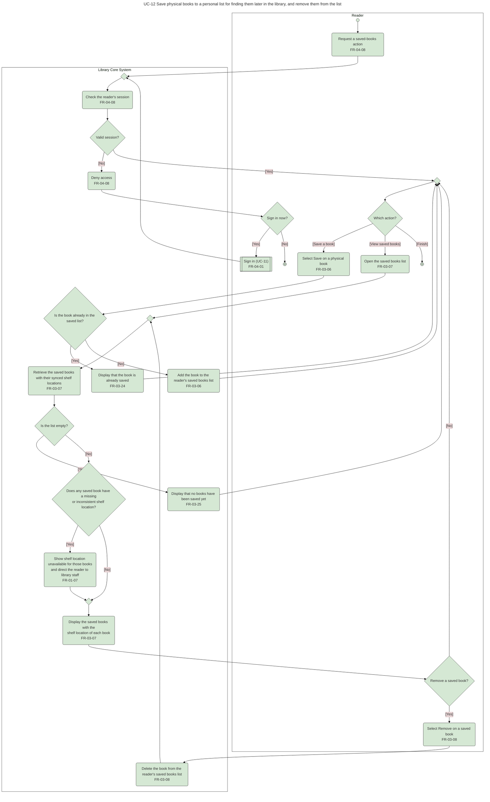

```mermaid
---
title: UC-12 Save physical books to a personal list for finding them later in the library, and remove them from the list
config:
  theme: base
  themeVariables:
    primaryColor: "#d5e8d4"
    primaryBorderColor: "#333333"
    lineColor: "#000000"
    clusterBkg: "#ffffff"
    clusterBorder: "#333333"
---
flowchart TB
  subgraph RDR["Reader"]
    direction TB
    start@{ shape: sm-circ }
    r1("Request a saved-books action<br/>FR-04-08")
    d1{"Sign in now?"}
    c1[["Sign in (UC-11)<br/>FR-04-01"]]
    m1{" "}
    d2{"Which action?"}
    r2("Select Save on a physical book<br/>FR-03-06")
    r3("Open the saved books list<br/>FR-03-07")
    d6{"Remove a saved book?"}
    r4("Select Remove on a saved book<br/>FR-03-08")
    stop1@{ shape: fr-circ }
    stop2@{ shape: fr-circ }
  end
  subgraph SYS["Library Core System"]
    direction TB
    m0{" "}
    s0("Check the reader's session<br/>FR-04-08")
    d0{"Valid session?"}
    s1("Deny access<br/>FR-04-08")
    d3{"Is the book already in the saved list?"}
    s2("Display that the book is already saved<br/>FR-03-24")
    s3("Add the book to the reader's saved books list<br/>FR-03-06")
    m2{" "}
    s4("Retrieve the saved books with their synced shelf locations<br/>FR-03-07")
    d4{"Is the list empty?"}
    s5("Display that no books have been saved yet<br/>FR-03-25")
    d5{"Does any saved book have a missing<br/>or inconsistent shelf location?"}
    s6("Show shelf location unavailable for those books<br/>and direct the reader to library staff<br/>FR-01-07")
    m3{" "}
    s7("Display the saved books with the<br/>shelf location of each book<br/>FR-03-07")
    s8("Delete the book from the reader's saved books list<br/>FR-03-08")
  end

  start --> r1 --> m0 --> s0 --> d0
  d0 -->|"[No]"| s1 --> d1
  d1 -->|"[Yes]"| c1 --> m0
  d1 -->|"[No]"| stop1
  d0 -->|"[Yes]"| m1 --> d2
  d2 -->|"[Save a book]"| r2 --> d3
  d3 -->|"[Yes]"| s2 --> m1
  d3 -->|"[No]"| s3 --> m1
  d2 -->|"[View saved books]"| r3 --> m2 --> s4 --> d4
  d4 -->|"[Yes]"| s5 --> m1
  d4 -->|"[No]"| d5
  d5 -->|"[Yes]"| s6 --> m3
  d5 -->|"[No]"| m3
  m3 --> s7 --> d6
  d6 -->|"[Yes]"| r4 --> s8 --> m2
  d6 -->|"[No]"| m1
  d2 -->|"[Finish]"| stop2
```
