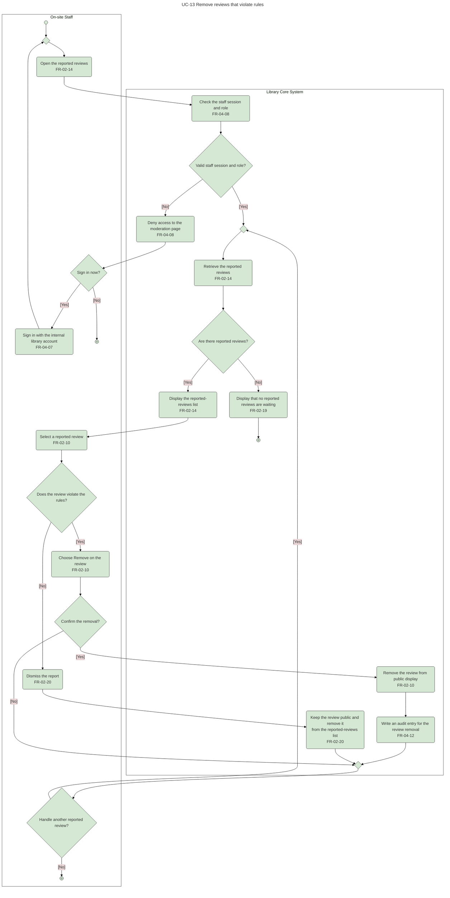

```mermaid
---
title: UC-13 Remove reviews that violate rules
config:
  theme: base
  themeVariables:
    primaryColor: "#d5e8d4"
    primaryBorderColor: "#333333"
    lineColor: "#000000"
    clusterBkg: "#ffffff"
    clusterBorder: "#333333"
---
flowchart TB
  subgraph STF["On-site Staff"]
    direction TB
    start@{ shape: sm-circ }
    m0{" "}
    a1("Open the reported reviews<br/>FR-02-14")
    d1{"Sign in now?"}
    a2("Sign in with the internal library account<br/>FR-04-07")
    a3("Select a reported review<br/>FR-02-10")
    d3{"Does the review violate the rules?"}
    a4("Choose Remove on the review<br/>FR-02-10")
    d4{"Confirm the removal?"}
    a5("Dismiss the report<br/>FR-02-20")
    d5{"Handle another reported review?"}
    stop1@{ shape: fr-circ }
    stop3@{ shape: fr-circ }
  end
  subgraph SYS["Library Core System"]
    direction TB
    s0("Check the staff session and role<br/>FR-04-08")
    d0{"Valid staff session and role?"}
    s1("Deny access to the moderation page<br/>FR-04-08")
    m1{" "}
    s2("Retrieve the reported reviews<br/>FR-02-14")
    d2{"Are there reported reviews?"}
    s3("Display that no reported reviews are waiting<br/>FR-02-19")
    s4("Display the reported-reviews list<br/>FR-02-14")
    s5("Remove the review from public display<br/>FR-02-10")
    s6("Write an audit entry for the review removal<br/>FR-04-12")
    s7("Keep the review public and remove it<br/>from the reported-reviews list<br/>FR-02-20")
    m2{" "}
    stop2@{ shape: fr-circ }
  end

  start --> m0 --> a1 --> s0 --> d0
  d0 -->|"[No]"| s1 --> d1
  d1 -->|"[Yes]"| a2 --> m0
  d1 -->|"[No]"| stop1
  d0 -->|"[Yes]"| m1 --> s2 --> d2
  d2 -->|"[No]"| s3 --> stop2
  d2 -->|"[Yes]"| s4 --> a3 --> d3
  d3 -->|"[Yes]"| a4 --> d4
  d4 -->|"[Yes]"| s5 --> s6 --> m2
  d4 -->|"[No]"| m2
  d3 -->|"[No]"| a5 --> s7 --> m2
  m2 --> d5
  d5 -->|"[Yes]"| m1
  d5 -->|"[No]"| stop3
```
