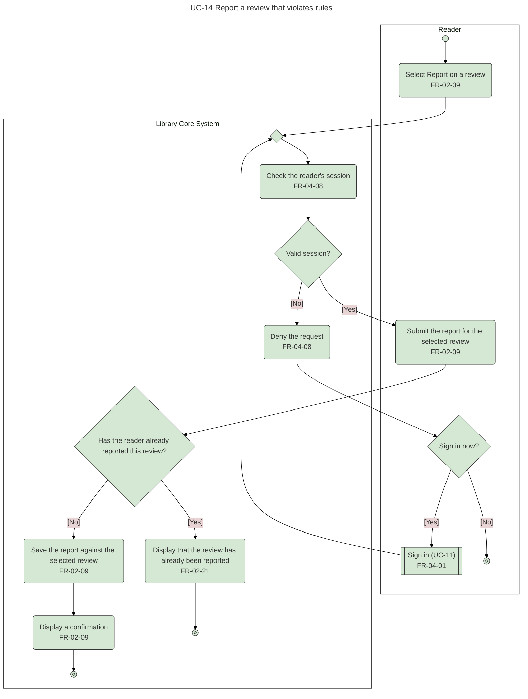

```mermaid
---
title: UC-14 Report a review that violates rules
config:
  theme: base
  themeVariables:
    primaryColor: "#d5e8d4"
    primaryBorderColor: "#333333"
    lineColor: "#000000"
    clusterBkg: "#ffffff"
    clusterBorder: "#333333"
---
flowchart TB
  subgraph RDR["Reader"]
    direction TB
    start@{ shape: sm-circ }
    r1("Select Report on a review<br/>FR-02-09")
    d1{"Sign in now?"}
    c1[["Sign in (UC-11)<br/>FR-04-01"]]
    r2("Submit the report for the selected review<br/>FR-02-09")
    stop1@{ shape: fr-circ }
  end
  subgraph SYS["Library Core System"]
    direction TB
    m0{" "}
    s0("Check the reader's session<br/>FR-04-08")
    d0{"Valid session?"}
    s1("Deny the request<br/>FR-04-08")
    d2{"Has the reader already reported this review?"}
    s2("Display that the review has already been reported<br/>FR-02-21")
    s3("Save the report against the selected review<br/>FR-02-09")
    s4("Display a confirmation<br/>FR-02-09")
    stop2@{ shape: fr-circ }
    stop3@{ shape: fr-circ }
  end

  start --> r1 --> m0 --> s0 --> d0
  d0 -->|"[No]"| s1 --> d1
  d1 -->|"[Yes]"| c1 --> m0
  d1 -->|"[No]"| stop1
  d0 -->|"[Yes]"| r2 --> d2
  d2 -->|"[Yes]"| s2 --> stop2
  d2 -->|"[No]"| s3 --> s4 --> stop3
```
